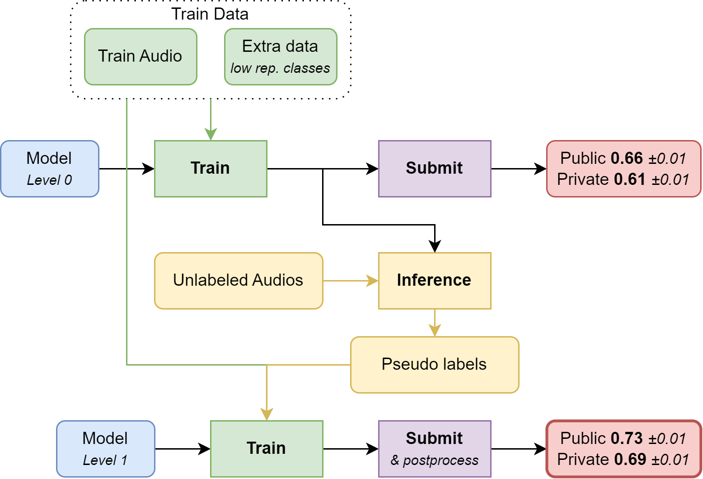

# 3rd Place Solution to the BirdCLEF 2024 Competition - Theo's part

**Authors :** [Theo Viel](https://github.com/TheoViel)

This repo contains my part of the solution to the 3rd place solution of the BirdCLEF 2024 challenge.
By itself, it achieves a public score of 0.72 and a private score of 0.70.

## Introduction - Adapted from [Kaggle](TODO)




## How to use the repository

### Prerequisites

- Clone the repository

- Download the data in the `input` folder:
  - [Competition data](https://www.kaggle.com/competitions/birdclef-2024/dataa)
  - [Extra xenocanto data](https://www.kaggle.com/datasets/ludovick/birdclef2024-additional-mp3)
  - [Other data](https://www.kaggle.com/datasets/theoviel/birdclef-2024-prev-data-fts)


The input folder should at least contain the following:
```
input
├── prev_comps_features       # From the my dataset
├── train_audio               # From the competiton data
├── unlabeled_soundscaptes    # From the competiton data
├── xenocanto                 # From ludovick's dataset
│   ├── audio
│   └── BirdClef2024_additional.csv
├── df_extra_comp.csv        # From my dataset
└── train_metadata.csv       # From the competiton data
```

- Setup the environment :
  - `pip install -r requirements.txt`

- I also provide trained model weights used to achieve private LB 0.70:
  - [Link](https://www.kaggle.com/datasets/theoviel/birdclef-2024-weights-3/).
  - The inference code is available [here](https://www.kaggle.com/code/theoviel/birdclef-2024-inf-v2)


### Run The pipeline

1. Preprocess the audios using `notebooks/Preparation.ipynb`
2. Train first level models using `bash train.sh`
3. Generate the associated pseudo-labels using `notebooks/Inference_v2.ipynb`
4. Train second level models using `bash train_2.sh`
    - Make sure to update the configs in `src/main_cnn_2.py` and `src/main_vit_2.py` to use the experiments from step 2.
    - `bash crop_train.sh` will train the crop classification model


### Code structure

If you wish to dive into the code, the repository naming should be straight-forward. Each function is documented.
The structure is the following :

```
src
├── data
│   ├── dataset.py              # Dataset classes
│   ├── loader.py               # Dataloader
│   ├── mix.py                  # Mixup
│   ├── preparation.py          # Data preparation
│   └── processing.py           # Data processing 
├── inference                
│   └── predict.py              # Predict utils for PLs
├── model_zoo 
│   ├── layers.py               # Custom layers
│   ├── melspec.py              # Melspec and specaugment layers
│   └── models.py               # Classification model
├── training                        
│   ├── losses.py               # Losses
│   ├── main.py                 # k-fold and train function
│   ├── optim.py                # Optimizers
│   └── train.py                # Torch fit and eval functions
├── util
│   ├── logger.py               # Logging utils
│   ├── metrics.py              # Metrics for the competition
│   ├── plots.py                # Plotting utils
│   └── torch.py                # Torch utils
├── main_cnn_2.py               # 2nd level cnn traning
├── main_seg_cls.py             # 1st level cnn traning
├── main_seg.py                 # 2nd level vit traning
├── main.py                     # 1st level vit traning
└── params.py                   # Main parameters
``` 
